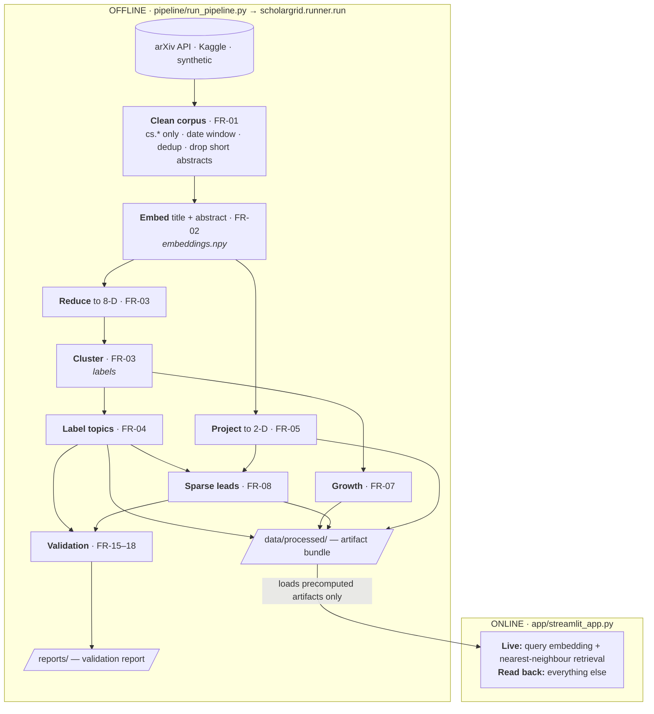

> **Documentation status (2026-10-10):** Historical v1 reference. Its single-map UI and module inventory are superseded by the current code and [UX / architecture review](ux-review.md). Algorithm descriptions may still be useful.

# ScholarGrid — Implementation Details

Technical reference for **version 1** of ScholarGrid (the Research Landscape
Explorer). It explains the architecture, every module, the algorithms, the
artifact formats, the web app, and how all of it maps back to the SRS
(`Docs/ScholarGrid_SRS.md`).

> **Audience:** developers extending or deploying ScholarGrid.

---

## 1. Design in one picture

ScholarGrid is split into a heavy **offline pipeline** that precomputes
everything, and a light **online app** that only reads the results back
(NFR-01).



| Stage | Where it runs | Requirement | Output |
|---|---|---|---|
| Ingest & clean | offline | FR-01 | cleaned corpus |
| Embed | offline | FR-02 | `embeddings.npy` |
| Reduce (8-D) → cluster | offline | FR-03 | cluster labels |
| Topic labelling | offline | FR-04 | keywords + representative papers |
| 2-D projection (from embeddings) | offline | FR-05 | map coordinates |
| Growth / sparse leads | offline | FR-07 / FR-08 | trend + gap tables |
| Validation | offline | FR-15–18 | `reports/` (`.md` + `.json`) |
| Search & browse | **online** | — | live query embedding + nearest-neighbour lookup |

The expensive work is all **offline**, so the deployed app stays light (NFR-01).

---

## 2. Repository layout (NFR-04)

| Path | Role |
|---|---|
| `configs/config.yaml` | every parameter and seed — the single source of truth |
| `configs/validation_queries.json` | 16-query known-item search benchmark (FR-16) |
| `scholargrid/` | reusable library, one module per pipeline stage |
| `pipeline/run_pipeline.py` | thin CLI wrapper over `scholargrid.runner.run` |
| `app/streamlit_app.py` | the web application |
| `app.py` | root entry shim (Hugging Face Spaces / `streamlit run app.py`) |
| `notebooks/` | interactive exploration guide |
| `data/raw/` | cached harvest (`arxiv_harvest.csv`) — gitignored |
| `data/processed/` | the artifact bundle the app reads — gitignored |
| `reports/` | generated validation report (`.md` + `.json`) |

---

## 3. The `scholargrid` library

| Module | Requirement | What it does |
|---|---|---|
| `config.py` | NFR-03 | loads YAML; **capability detection** resolves `auto` backends to the SRS library if installed, else a fallback; exposes absolute paths. |
| `utils.py` | — | logging, seeding, JSON IO, L2-normalise, cosine top-k. |
| `data_ingest.py` | FR-01 | harvest/load + clean the corpus; `snapshot_info()` for metadata. |
| `embeddings.py` | FR-02 | `Embedder` with `minilm`/`tfidf` backends; `save/load` so queries embed identically at runtime. |
| `reduce.py` | FR-03/05 | analytical n-D reduction **and** a separate 2-D projection (UMAP or PCA). |
| `clustering.py` | FR-03 | HDBSCAN → DBSCAN (self-tuned `eps`) → KMeans fallback; noise preserved as `-1`. |
| `labeling.py` | FR-04 | c-TF-IDF keywords + centroid-nearest representative papers. |
| `growth.py` | FR-07 | normalised relative growth, monthly counts, stability. |
| `sparse.py` | FR-08 | sparse-neighbourhood "investigation leads" with HD + projection checks. |
| `search.py` | FR-06 | query embed → cosine top-k → cluster distribution. |
| `validation.py` | FR-15–18 | cluster/search/growth/projection validation + report writer. |
| `artifacts.py` | deploy | `save_bundle` / `load_bundle` / `bundle_exists`. |
| `runner.py` | NFR-04 | orchestrates all stages (used by CLI and the app's demo button). |

---

## 4. Algorithms

### 4.1 Embeddings (FR-02)
Both backends embed **title + abstract** and the user's query with the *same*
transformation.

- **`minilm`** — `sentence-transformers` `all-MiniLM-L6-v2` (SRS baseline), 384-D,
  L2-normalised.
- **`tfidf`** (offline fallback) — `TfidfVectorizer` (1–2 grams, English stop
  words) → `TruncatedSVD` to 256-D → L2-normalise. The fitted vectorizer + SVD
  are pickled to `data/processed/embedder/` so the app reproduces query vectors
  exactly.

### 4.2 Reduction + clustering (FR-03)
Embeddings → **8-D** (UMAP if installed, else PCA) for clustering, then:

1. **HDBSCAN** when available (SRS baseline).
2. else **DBSCAN** with a self-tuned `eps`: the knee of the sorted k-distance
   curve plus a percentile scan, choosing the `eps` that maximises cluster count
   while keeping the noise fraction ≤ 0.6.
3. If density clustering still yields `< fallback_min_clusters` (default 4) —
   common for TF-IDF embeddings, which lack sharp density valleys — a
   **silhouette-selected KMeans** runs instead, marking points beyond the 98th
   centroid-distance percentile as noise so the FR-03 noise concept is kept.

Clusters smaller than `min_cluster_size` are returned to noise and ids are
renumbered `0..K-1`.

### 4.3 Labels (FR-04)
Class-based TF-IDF (the BERTopic formulation):

```
c-TF-IDF(t, c) = tf(t, c) / words(c) · log(1 + A / df(t))      A = mean words per class
```

Top keywords form the label; representative papers are those nearest the
cluster's embedding centroid (cosine). Both are stored, so a label is always
explainable.

### 4.4 Growth (FR-07)
For reference date *r* (default = latest paper) and window *W* months:

```
recent   = papers in (r−W, r]
previous = papers in (r−2W, r−W]
raw_growth(c)      = (recent+1) / (previous+1)
relative_growth(c) = raw_growth(c) / raw_growth(all_CS)
```

Computed for **3/6/12-month** windows. `relative_growth > 1` ⇒ the area grew
faster than the whole CS corpus. **Absolute recent counts are always stored and
shown** so volume and rate are never conflated (FR-14). Stability = coefficient
of variation of relative growth across windows (`stable` if CV < 0.35).

### 4.5 Sparse neighbourhoods (FR-08)
1. **2-D anchors** — points in the lowest `low_density_percentile` of local
   density that also *border* clustered points (near, not inside, an area).
2. **High-dimensional check** — keep anchors whose distance to their k-th
   nearest neighbour in embedding space is ≥ the corpus median (sparse in HD,
   not just in the projection).
3. **Projection robustness** — re-project under several seeds **and bootstrap
   subsamples** (the subsample test also exercises deterministic PCA); keep only
   anchors that stay low-density in ≥ `min_robustness` of projections.
4. Rank by HD sparsity, de-duplicate nearby anchors, attach the nearest cluster
   and nearby papers as **evidence**. Always labelled *investigation leads, not
   research gaps.*

### 4.6 Validation (FR-15–18)
- **Clusters** — sizes, noise fraction, mean embedding cohesion, silhouette.
- **Search** — relevance rate / precision@k over the 16-query benchmark
  (a result counts as relevant if its category or title matches the expected
  categories/keywords).
- **Growth** — recompute across windows **and alternate cutoff dates**; flag
  clusters with CV > 0.5 as unstable.
- **Projection** — mean/min robustness of the reported leads.

Written to `reports/validation_report.{md,json}`.

---

## 5. Backends & graceful degradation

| Stage | Preferred (SRS baseline) | Fallback (always available) |
|---|---|---|
| Embedding | `sentence-transformers` all-MiniLM-L6-v2 | TF-IDF → SVD → L2 |
| Reduction | UMAP | PCA |
| Clustering | HDBSCAN | DBSCAN → KMeans |

`config.resolve_*` picks the preferred backend when importable, else the
fallback. The **resolved choice is recorded in `meta.json`** and shown in the
app's *How it works* panel, so every run is self-describing. Set a backend
explicitly in `config.yaml` to force it.

> Why fallbacks? The baseline wheels did not install on the Python 3.14 build
> used during development. The fallbacks let the full system run and be
> validated anywhere; installing the baseline libraries improves cluster
> separation and search quality without any code change.

---

## 6. Artifact bundle (`data/processed/`)

| File | Contents |
|---|---|
| `papers.csv` | one row per paper: `arxiv_id, title, abstract, categories, primary_category, date, year_month, cluster_id, x2d, y2d` |
| `embeddings.npy` | float32 `[n_papers, dim]`, L2-normalised |
| `reduced.npy` | float32 `[n_papers, 8]` (analytical space) |
| `clusters.json` | per cluster: `label, keywords, size, representative_papers, top_categories, growth` |
| `growth.json` | reference date, windows, corpus raw growth, per-cluster windows + monthly counts + stability |
| `sparse.json` | investigation leads with anchor, robustness, nearest cluster, evidence papers |
| `meta.json` | version, seed, snapshot info, resolved backends, parameters, counts |
| `embedder/` | pickled embedder state for runtime query embedding |

`bundle_exists()` gates the app; `load_bundle()` returns a `Bundle` dataclass.

---

## 7. The web app (`app/streamlit_app.py`)

Design goals: **low text, progressive disclosure, direct manipulation.**

- **Clean theme** (`.streamlit/config.toml`) — light, neutral, one calm accent;
  no neon, no glassmorphism.
- **First run** — onboarding with a one-click *Load demo data* button (builds an
  offline synthetic landscape in ~5 s) or the real-harvest command.
- **Search** — one box + example chips; results ranked with similarity, cluster
  distribution shown as small chips, ambiguity flagged.
- **Interactive map** — WebGL `Scattergl`; **click or lasso points to inspect
  papers** (`st.plotly_chart(on_select=...)`, each point carries its paper index
  as `customdata`). Focusing an area dims the rest.
- **Context panel** — one panel that adapts: search results → selected papers →
  cluster details → *Research areas* overview.
- **Secondary info** — Growth, Investigation leads, How it works, Limitations,
  Dataset — all collapsed expanders.
- **Evidence everywhere** — every item links to `arxiv.org/abs/<id>` (NFR-06).

Only `search.py` runs live; everything else is read from the bundle.

---

## 8. Reproducibility (NFR-03)

Pinned dependencies (`requirements.txt`), a single seeded config, a cached raw
harvest (`data/raw/arxiv_harvest.csv`), stored embeddings / cluster assignments /
2-D coordinates, and `meta.json` tying each run to its pipeline version and
resolved backends. Re-running the pipeline reproduces the bundle.

---

## 9. SRS traceability (summary)

| SRS | Where |
|---|---|
| FR-01 … FR-08 | `data_ingest`, `embeddings`, `reduce`+`clustering`, `labeling`, `reduce.project_2d`, `search`, `growth`, `sparse` |
| FR-10 … FR-14 | app context panels, filters, cluster panel, *How it works*, *Limitations* |
| FR-15 … FR-18 | `validation.py` → `reports/` |
| NFR-01 … NFR-06 | precomputed bundle; config params; pinned deps + meta; package layout; low-text UI; arXiv links on every signal |
| §16.1 UI components | all present in the app |
| §20 acceptance | public app, visible snapshot/methodology, benchmarked search, interpretable clusters, representative papers, normalised+absolute growth, robustness reported, leads double-checked, no "proven gap" language |

---

## 10. Out of scope for v1 (SRS stretch)

- **FR-09** semantic-citation missing-link analysis (OpenAlex).
- Monthly refresh pipelines.
- Beginner research-entry recommendations.

### Extension points
- **Better quality:** `pip install sentence-transformers umap-learn hdbscan`
  (auto-detected).
- **Bigger corpus:** raise `data.max_papers`; the app renders WebGL and loads
  detail on interaction (NFR-02).
- **Citation feature:** add `scholargrid/citations.py` (OpenAlex), write a
  `citations.json` artifact, and a new app expander — mirror the existing module
  pattern and keep the "potential missing connection" framing.
